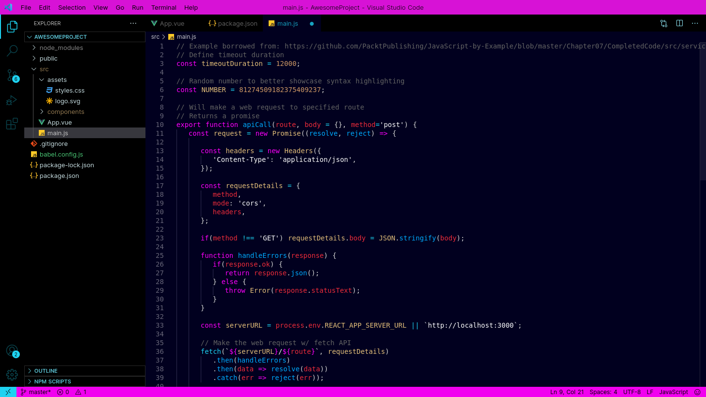

# VS Code Rabbit Junk Color Theme

## About

Inspired by [Rabbit Junk](https://rabbitjunk.com/) | Fork [here](https://themes.vscode.one/theme/ctang/JWFPQegb) @ [themes.vvscode.one](https://themes.vscode.one/) 



Music can be listened and bought at [rabbitjunk.bandcamp.com](https://rabbitjunk.bandcamp.com/)

### Installation

Launch VS Code Quick Open (`Ctrl+P`), paste the following command, and press enter.

````
ext install evolution515-net.rabbit-junk-color-theme
````

---

[Theme Extension Page](https://marketplace.visualstudio.com/items?itemName=evolution515-net.rabbit-junk-color-theme)  | Thanks for the great music! | Thanks to Mike Tromba for the [theme editor](http://themes.vscode.one/) @ [vscode.one](http://www.vscode.one/)!

